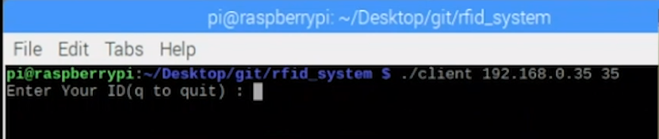
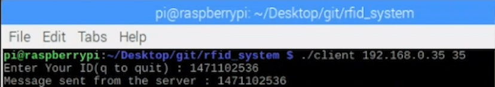
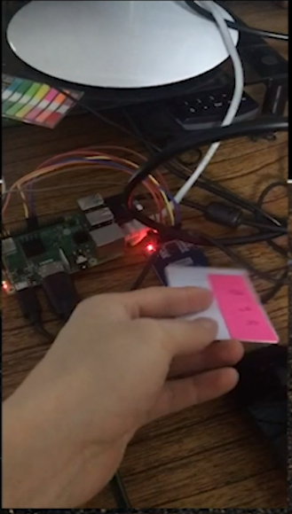
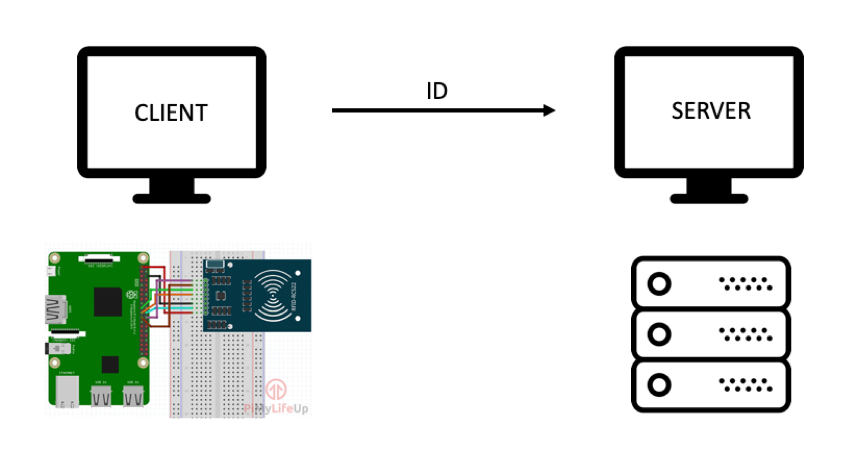
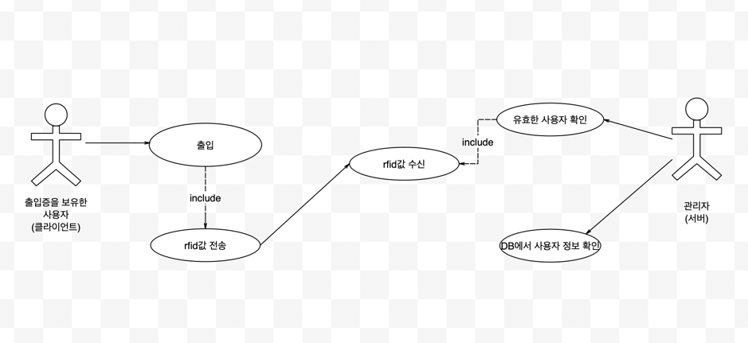
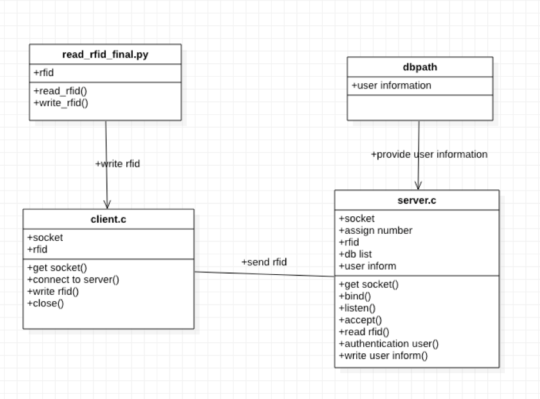

# rfid_system
https://youtu.be/C6tsv059DCo

프로젝트명: RIFD 사용자 출입증

1. 개요
 서버클라이언트 채팅 프로그램과 RFID를 원거리에서 사용자의 출입을 확인하는 프로그램을 구현한다. 
 클라이언트에서는 RIFD 번호를 읽어 들이고 서버에게 읽어들인 ID를 전달, 서버는 ID를 받아 내부 DB에서 해당하는 ID의 정보를 출력해준다.
 
 
 
2. 실행화면

 a) 서버 연결
    

 b) rfid 리더기 실행 및 클라이언트 연결
    
    
 c) rfid 카드 입력(클라이언트)
    
    
    
 d) 유저 정보 출력(서버)
    
    
    
    
 3. 시스템 구성도
    
    - 클라이언트 컴퓨터 측에 라즈베리파이를 이용한 RFID 리더기 구현
    - 리더기를 통해 읽어들인 ID를 서버 컴퓨터로 전송
    - 서버는 읽어들인 ID를 인증여부를 판별
    - 인증된 ID값일 경우 내부 DB에서 찾아 정보를 출력
    
    
    
 4. 시스템 디자인
    
     a) 사용자는 출입 시 rfid 카드를 리더기에 입력

     b) 클라이언트 측 컴퓨터는 rfid값을 읽어들이고 원거리에 있는 서버 측으로 출입한 사용자의 rfid 값을 전송

     c) 서버는 rfid 값을 수신하여 데이터가 저장되어있는 디렉토리 목록을 읽어 들여 등록 되어있는 사용자 인지 판별(인증)

     d) 등록되어 있는 사용자라면 사용자의 관련된 데이터를 관리자가 볼 수 있게 출력해주고 등록되어 있지 않은 사용자라면 
     인증되지 않은 사용자가 접근하였다는 경고를 출력
     
     
     
  5. 시스템 내부 구조
     
     a) read_rfid_final.py :  rfid 값을 읽어 들이는 소스 코드. rfid 리더기 모듈을 사용하는데 있어 파이썬이 적합하여 부득이하게 파이썬 코드를 사용
        카드가 리더기에 읽히게 되면 pyautogui라는 매크로를 사용하여 client에 rfid값을 문자열로 변환하여 자동으로 타이핑 하여 입력.

     b) client.c : 최초 실행 시 server에 연결하여 소켓 통신 대기 상태. read_rfid_final.py를 통해 쉘에 rfid 값이 입력되면 서버측으로 전송

     c) server.c : 최초 실행 시 client의 입력 값을 대기 상태. 클라이언트 측으로 부터 rfid값을 수신하게 되면 data가 저장된 
        디렉토리의 리스트를 읽어 허가된 사용자인지 판별하게 됨. 만약 rfid값이 없다면 비인증 사용자임으로 경고 메세지를 출력하고
        인증된 사용자일 경우 쉘창에 사용자와 관련된 정보를 출력

 
